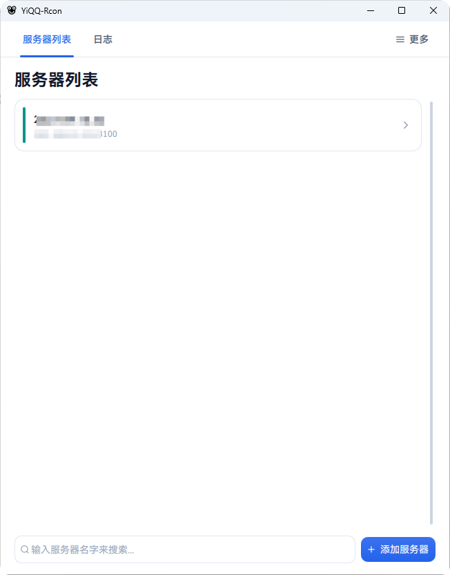
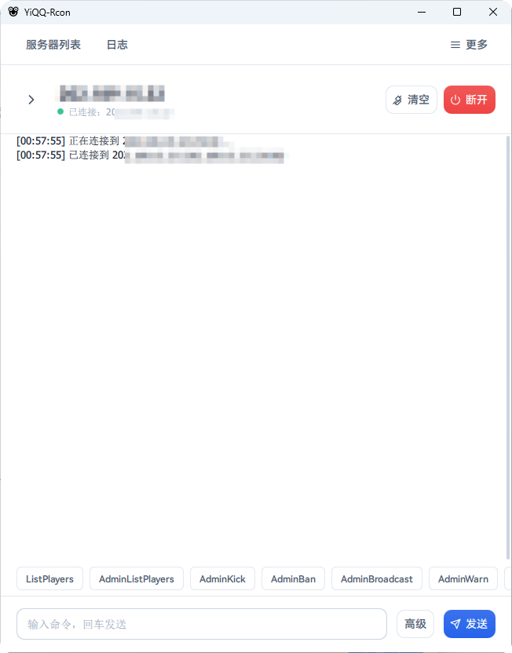

# YiQQ-Rcon
基于 Python + PySide6 + QML 构建的现代风格 RCON 管理工具，支持多种游戏服务器的远程管理。

<table>
  <tr>
    <td></td>
    <td></td>
  </tr>
</table>

## 功能特性

- **多服务器管理** - 集中管理多个 RCON 服务器，一键切换连接
- **密码加密存储** - 跨平台本地加密（Windows 使用 DPAPI，macOS/Linux 使用 Fernet 派生密钥）
- **SOCKS5 代理** - 支持通过 SOCKS5 代理连接 RCON 服务器
- **命令历史** - 按服务器记录命令历史，支持重发
- **快捷命令** - 内置多种游戏常用命令模板，一键执行
- **原始数据包查看** - 高级模式下可查看 RCON 收发的原始数据包
- **多语言支持** - 简体中文 / English
- **主题切换** - 浅色 / 深色 / 跟随系统
- **运行日志** - 实时查看应用运行日志

## 支持的游戏

| 游戏 | 实例类型 |
| --- | --- |
| Minecraft | minecraft |
| Squad | squad |
| Counter-Strike 2 | cs2 |
| 幻兽帕鲁 (Palworld) | palworld |
| 通用 RCON 服务 | generic |

## 技术栈

- Python 3.11+
- PySide6 (Qt for Python)
- QML / Qt Quick
- PyInstaller（打包构建）
- PySocks（代理支持）

## 环境要求

- Windows 10/11、macOS 11+、主流 Linux 桌面发行版
- Python 3.11+(Releases 打包版本无需安装)

## 快速开始

1. 克隆仓库

```bash
git clone https://github.com/你的用户名/rcon.git
cd rcon
```

2. 安装依赖

```bash
pip install PySide6 PySocks cryptography
```

3. 运行程序

```bash
python main.py
```

## 构建打包

使用 PyInstaller 打包为独立可执行文件：

```bash
pip install pyinstaller
pyinstaller build.spec
```

构建产物位于 `dist/YiQQ-Rcon/` 目录下。

## 项目结构

```
rcon/
├── assets/                 # 资源文件
│   ├── fonts/              #   字体（HarmonyOS Sans SC）
│   ├── i18n/               #   国际化文案
│   └── avatar.png          #   头像
├── core/                   # 核心业务逻辑
│   ├── rcon_client.py      #   RCON 协议客户端
│   ├── server_manager.py   #   服务器管理
│   ├── security.py         #   密码加解密（DPAPI / Fernet）
│   ├── config_manager.py   #   配置管理
│   ├── command_history.py  #   命令历史
│   ├── quick_commands.py   #   快捷命令模板
│   ├── i18n.py             #   国际化
│   └── paths.py            #   路径处理
├── ui/                     # UI 层
│   ├── bridges/            #   QML 桥接对象
│   ├── icon_provider.py    #   图标提供器
│   └── rcon_worker.py      #   RCON 工作线程
├── qml/                    # QML 界面
│   ├── Theme/              #   主题
│   ├── components/         #   通用组件
│   ├── dialogs/            #   对话框
│   ├── pages/              #   页面
│   ├── main.qml            #   主界面
│   └── utils.js            #   工具函数
├── data/                   # 运行时数据（已 gitignore）
│   ├── config.json         #   应用配置
│   ├── servers.json        #   服务器列表
│   └── history.json        #   命令历史
├── main.py                 # 程序入口
└── build.spec              # PyInstaller 构建配置
```

## 数据存储

- 开发模式：项目目录下的 `data/` 文件夹
- 打包后：`%APPDATA%/YiQQ-Rcon/`

服务器密码通过本地加密存储：Windows 使用 DPAPI（仅当前用户账户可解密），macOS/Linux 使用基于机器标识与用户名派生密钥的 Fernet 对称加密。

## 相关链接

- 官网：<https://rcon.qiovo.cn>
- 作者主页：<https://qiovo.cn>
